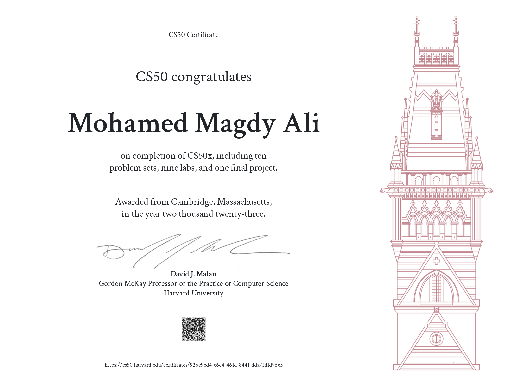

<h1 align="center">
Harvard CS50x — 2023
</h1>

# Certificate 
<a href="https://certificates.cs50.io/926c9cd4-e6e4-461d-8441-dda7fd1d95c3.png?size=letter">
  <h2> verified certificate </h2>
  
  <h2> </h2>
  
</a>

### DISCLAIMER:
Please don't just copy the code mindlessly without trying to solve the problems yourself, it's totally pointless if you actually wanna learn how to write software and a blatant violation of the [**Academic Honesty**](https://docs.cs50.net/2016/fall/syllabus/cs50.html#academic-honesty) policy of the course.
